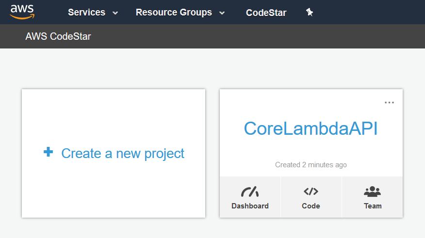
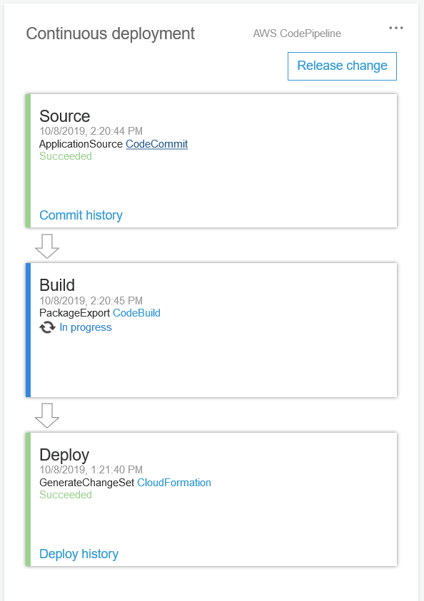
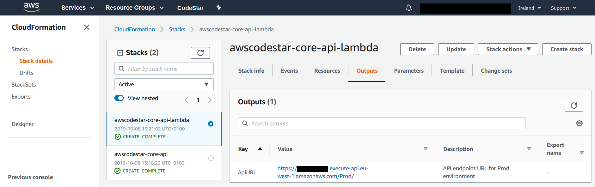
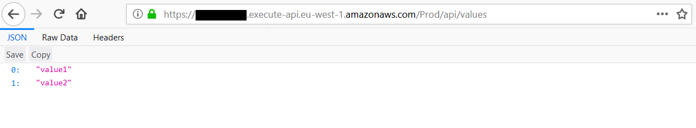

# codestar-dotnet-lambda
This repository defines an [AWS CodeStar]() project template for .NET Core web service for AWS Lambda.

AWS CodeStar provides a number of pre-baked project templates that helps with provision of complex 
CI/CD pipelines for a new project. This may be a common scenario for customers who want to standardize 
the pipelines created in the organization or even build-in some required security/compliance checks, 
manual approvals, multi-stage deployments, etc.

Having such a project template ready for Development teams to use may reduce time required to start 
a project and provides a way for architect teams to centralize and codify the best practices for the 
common project types.

This repository provides an example of creating such a template for .NET Core web service for 
AWS Lambda deployments.

## Before you start
AWS CodeStar uses a service role to provision the resources for your project.
It is created for you the first time you create a project in AWS CodeStar in the Console.

Please ensure that the role exists before you proceed to the [Installation](#Installation)

Find the additional details [here](https://docs.aws.amazon.com/codestar/latest/userguide/access-permissions-service-role.html).

## Installation
To create a new project based on the template, perform the following steps:

1. Clone the repository  
   ``` 
   git clone https://github.com/kolomied/codestar-dotnet-lambda.git 
   ```
1. Update ```install.sh``` providing the following values:
   - ```ACCOUNT_ID``` - your AWS account ID
   - ```PROJECT_ID``` - CodeStar project ID (15 symbols max)
   - ```PROJECT_NAME``` - CodeStar project name (what you see in  the Console)
   - ```PROJECT_DESCRIPTION``` - CodeStar project description
1. Create a new project  
   ```
   ./install.sh
   ```

If all is fine, you should see the ARN of the created project:
```json
{
    "arn": "arn:aws:codestar:eu-west-1:XXXXXXXXXXXX:project/core-api"
}
```

## Verify the deployment
Navigate to AWS CodeStar service in the Console and verify that new project is created:



CI/CD pipeline creation may take a minute or two to complete, but once it is done, you
will see that the project is building:



Once build is complete, navigate to CloudFormation in the Console. You should see two 
stacks:

 - ```awscodestar-core-api``` - this is a stack that contains all the pipelines resources
 - ```awscodestar-core-api-lambda``` - just deployed .NET Core API

 Navigate to ```Outputs``` section of the ```awscodestar-core-api-lambda``` stack to
 get the API URL:



Use this URL to execute the API, navigation the following URL (add ```api/values``` which
is the route for our Web API controller):

```
https://xxxxxxxxxx.execute-api.eu-west-1.amazonaws.com/Prod/api/values
```

